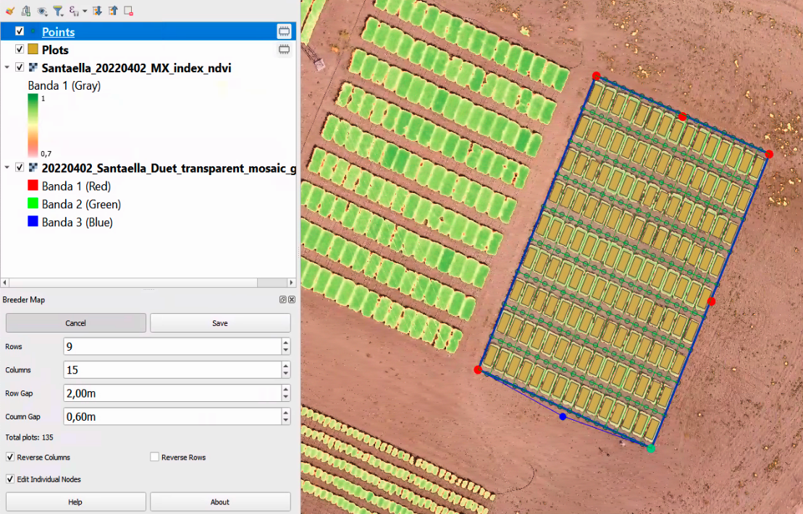
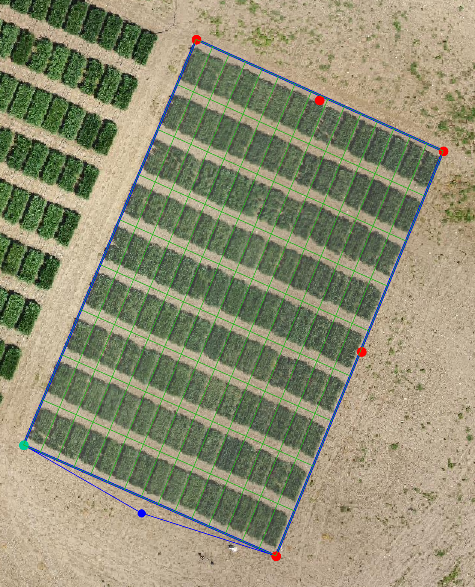
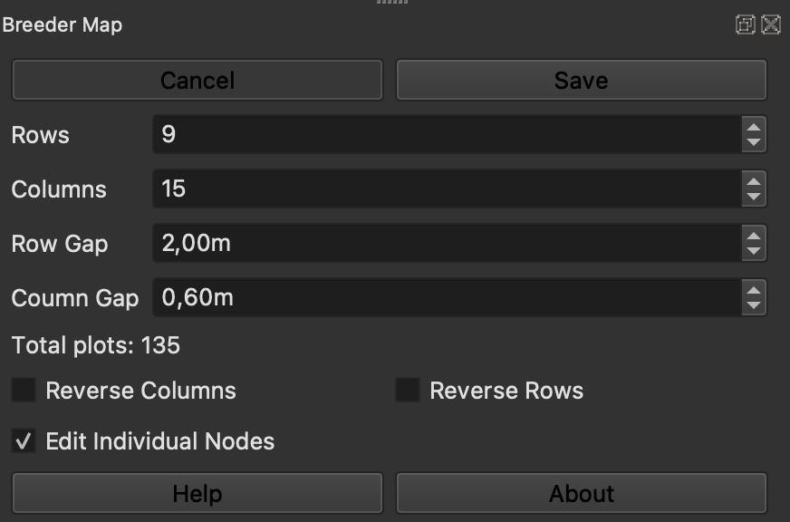
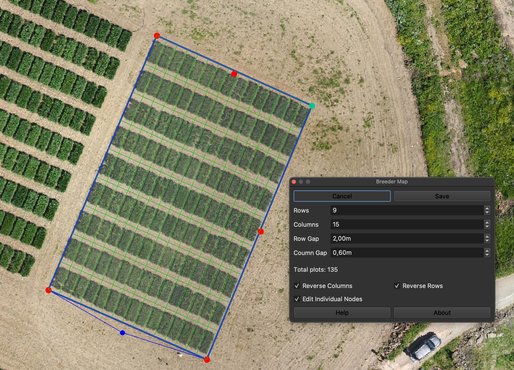
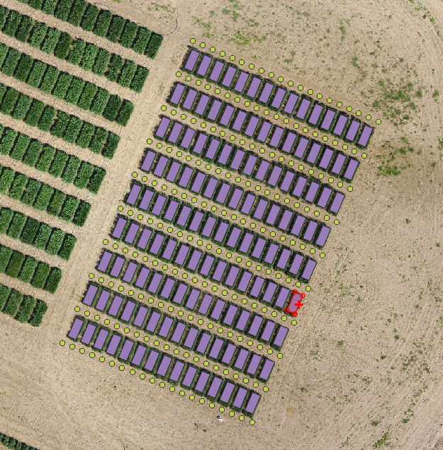
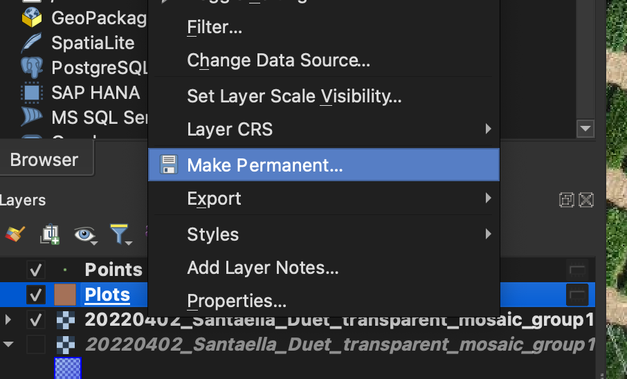

.. BreederMap documentation master file, created by
   sphinx-quickstart on Sun Feb 12 17:11:03 2012.
   You can adapt this file completely to your liking, but it should at least
   contain the root `toctree` directive.

Welcome to BreederMap's documentation!
============================================

.. toctree::
   :maxdepth: 2

.. index:: Concepts

Concepts
============

This plugin allows the creation of a grid of polygons that define the
plots in the breeding trial. These polygons will be labelled
automatically with auto-increments for columns and rows. The user
needs to specify the number of columns (each tractor track) and rows
(plots in the direction of the tractor when sowing) and the
gaps between plots. The grid placement is interactive, and it is
possible to edit the vertex independently for not regular shapes. It
is also essential to define the starting plot for correct automatic
numbering.

The plugin generates two temporary layers. One polygon layer and a
point layer. The polygon layer contains the plot and has three
attributes: columns, row and num as attributes. The num attribute is a
unique identifier calculated as “column” * 1000 + “row”. The point
layer contains points extracted at the plot gaps that can be used to
calculate the ground height when calculating plot height from a DEM.

.. index:: Basic

Basic usage
=============

Start the plugin by activating the panel with the Toolbar Icon.

.. image::_static/toolbar.png
   :align: center

The panel shows the primary inputs to create your grid: the number of
columns (each tractor track) and rows (plots in the direction of the
tractor when sowing), as well as the gaps between plots. Once defined,
click on “Start”, and the grid draft will be shown on the map.

.. image:: _static/field_layout.png
   :align: center

The placement of the grid is interactive. By dragging it to the middle of
the grid, the user can move it to the centre of the trial. Then,
rotate by clicking and dragging on the blue dot. The size can be
adjusted by dragging on the red dots. The greed dot represent the
first plot (column = 1, row = 1).

Once the grid is in place, it is possible to edit the vertex
independently for not regular shapes. Click on “Edit individual nodes” and
drag the corner dots independently.

It is also essential to define the starting plot for correct automatic
numbering. By clicking on “Reverse Columns” or “Reverse Rows”, the
location of the green dot will change, indicating the initial plot.

Once the grid matches the experimental layout, you can click on “Save”
to generate the temporary layers with the polygons and gap points.

The individual plots and points can be edited in QGIS as usual.

Please, remember to make the layers permanent otherwise, they will be
lost when closing QGIS.

Indices and tables
==================

* :ref:`genindex`
* :ref:`search`

